# Penetration Testing Report

Names: CheonSeok Oh & Jonathan Thornton

## Self attack

### Peer 1 (CheonSeok Oh):

| Item           | Result                                                                                                                             |
| -------------- | ---------------------------------------------------------------------------------------------------------------------------------- |
| Date           | April 9, 2026                                                                                                                      |
| Target         | https://pizza-service.cs329-jwt-pizza.click                                                                                        |
| Classification | Identification and Authentication Failures                                                                                         |
| Severity       | 1                                                                                                                                  |
| Description    | Performed a brute force attack on /api/auth using Burp Intruder. No unauthorized access was obtained.                              |
| Images         | 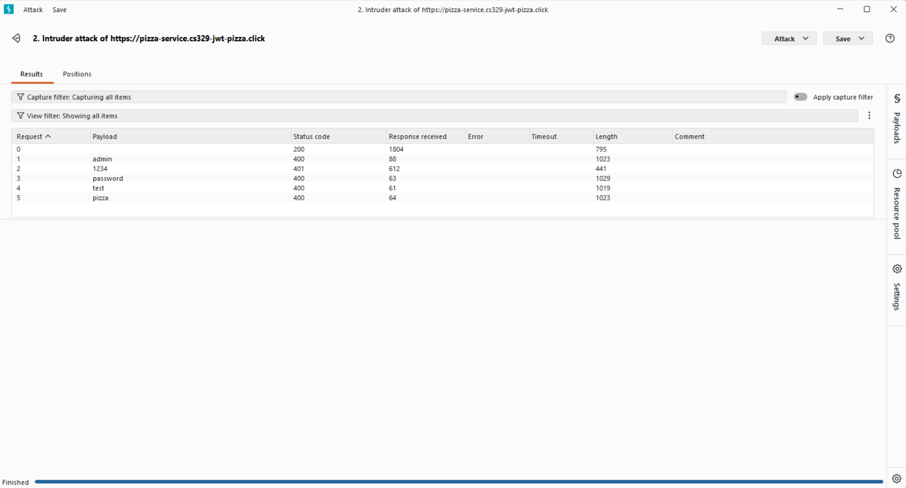   Intruder results showing different responses for each password attempt |
| Corrections    | Implement rate limiting, account lockout, and stronger password policies to prevent brute force attacks.                           |

| Item           | Result                                                                                                                                                                                           |
| -------------- | ------------------------------------------------------------------------------------------------------------------------------------------------------------------------------------------------ |
| Date           | April 13, 2026                                                                                                                                                                                   |
| Target         | https://pizza-service.cs329-jwt-pizza.click                                                                                                                                                      |
| Classification | Security Misconfiguration                                                                                                                                                                        |
| Severity       | 4                                                                                                                                                                                                |
| Description    | Performed a CORS misconfiguration test by modifying the Origin header to https://evil.com. The server accepted this origin and allowed credentials, indicating no validation of trusted domains. |
| Images         | 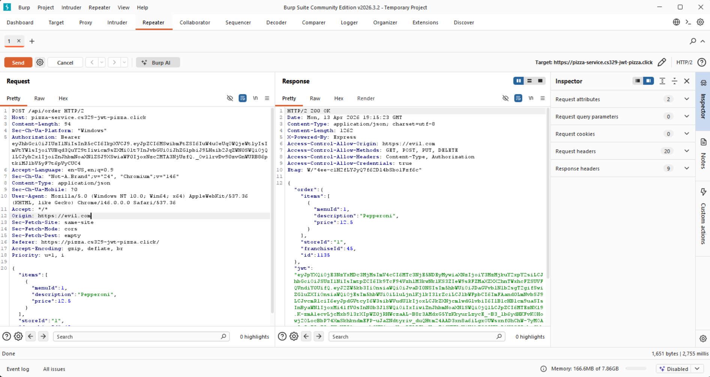   Response shows Access-Control-Allow-Origin set to https://evil.com with credentials enabled.                                                  |
| Corrections    | Restrict allowed origins to trusted domains and disable credentials for untrusted origins.                                                                                                       |

| Item           | Result                                                                                                                                                                      |
| -------------- | --------------------------------------------------------------------------------------------------------------------------------------------------------------------------- |
| Date           | April 13, 2026                                                                                                                                                              |
| Target         | https://pizza-service.cs329-jwt-pizza.click                                                                                                                                 |
| Classification | Injection                                                                                                                                                                   |
| Severity       | 1                                                                                                                                                                           |
| Description    | Attempted a SQL injection attack on /api/auth using crafted input. The server rejected the request and returned a 401 response, indicating that the input was not executed. |
| Images         | 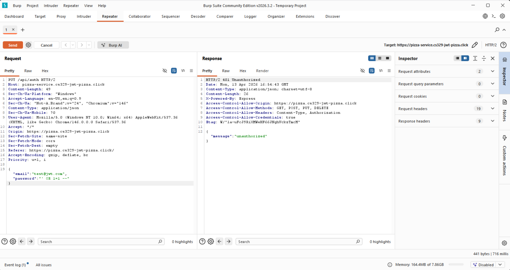   Repeater results showing unauthorized response (status code 401) and no authentication bypass.                           |
| Corrections    | Use input validation and parameterized queries to prevent SQL injection.                                                                                                    |

| Item           | Result                                                                                                                                                    |
| -------------- | --------------------------------------------------------------------------------------------------------------------------------------------------------- |
| Date           | April 13, 2026                                                                                                                                            |
| Target         | https://pizza-service.cs329-jwt-pizza.click                                                                                                               |
| Classification | Insecure Design                                                                                                                                           |
| Severity       | 1                                                                                                                                                         |
| Description    | Performed an invalid input test by sending empty values to the login endpoint. The server returned a 401 response and did not expose any internal errors. |
| Images         | 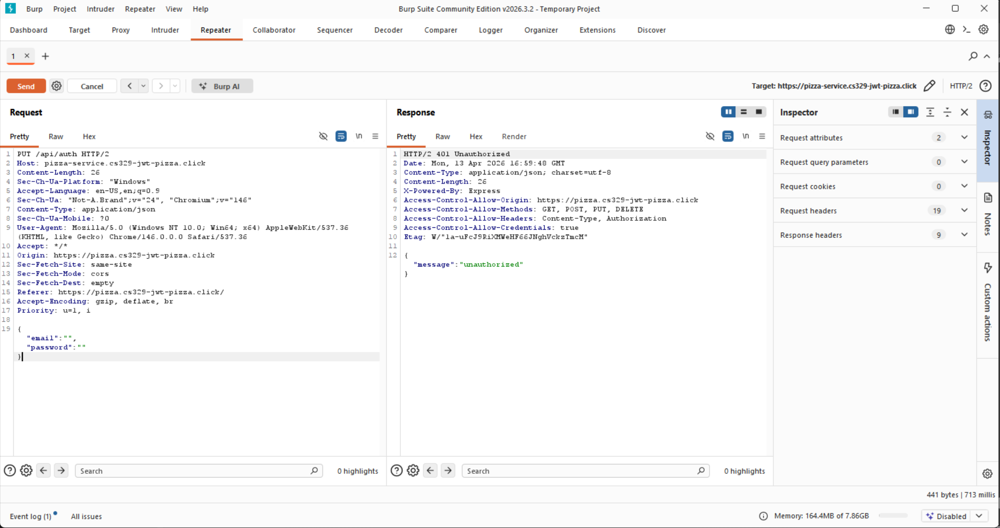   Repeater results showing unauthorized response (status code 401) without server errors.                |
| Corrections    | Validate and sanitize user input to ensure secure handling of unexpected data.                                                                            |

| Item           | Result                                                                                                                                                                     |
| -------------- | -------------------------------------------------------------------------------------------------------------------------------------------------------------------------- |
| Date           | April 13, 2026                                                                                                                                                             |
| Target         | https://pizza-service.cs329-jwt-pizza.click                                                                                                                                |
| Classification | Broken Access Control                                                                                                                                                      |
| Severity       | 4                                                                                                                                                                          |
| Description    | Performed a parameter tampering attack by modifying the price value in /api/order. The server accepted the manipulated value and created an order with the modified price. |
| Images         | 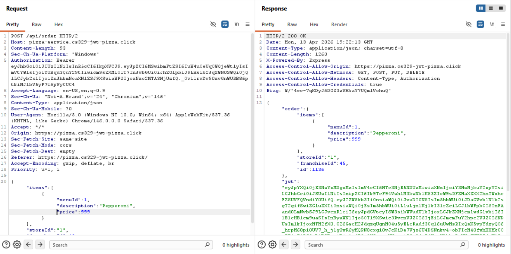   Response shows order created with the modified price value.                                                             |
| Corrections    | Validate all user input on the server and enforce proper access control checks.                                                                                            |

### Peer 2 (Jonathan Thornton):

| Item           | Result                                                                                        |
| -------------- | --------------------------------------------------------------------------------------------- |
| Date           | April 9, 2025                                                                                 |
| Target         | pizza.freevirus.click                                                                         |
| Classification | Security Misconfiguration                                                                     |
| Severity       | 3                                                                                             |
| Description    | Admin credentials compromised.                                                                |
| Images         | 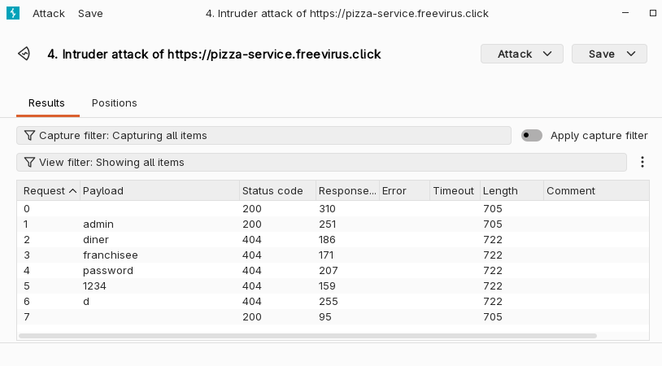   Successful admin login |
| Corrections    | Remove default admin password                                                                 |

| Item           | Result                                                                                                                                                                                                            |
| -------------- | ----------------------------------------------------------------------------------------------------------------------------------------------------------------------------------------------------------------- |
| Date           | April 9, 2025                                                                                                                                                                                                     |
| Target         | pizza.freevirus.click                                                                                                                                                                                             |
| Classification | Cryptographic Failures                                                                                                                                                                                            |
| Severity       | 0                                                                                                                                                                                                                 |
| Description    | Login tokens are excellently cryptographically random. Note that if the same user logs in more than once in the same UTC second, the authentication token will be the same, however, this isn't a security issue. |
| Images         | 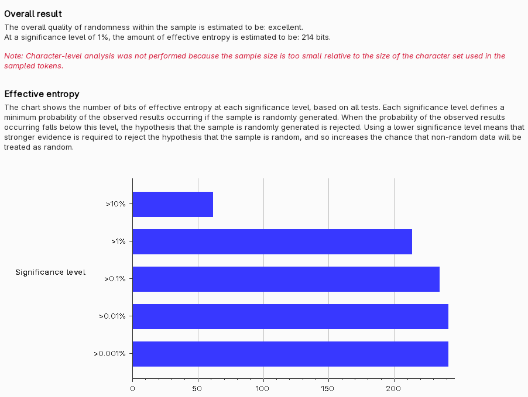   Successful admin login                                                                                                                    |
| Corrections    | Remove default admin password                                                                                                                                                                                     |

## Peer attack

### Peer 1 attack on peer 2:

| Item           | Result                                                                                                                                 |
| -------------- | -------------------------------------------------------------------------------------------------------------------------------------- |
| Date           | April 9, 2026                                                                                                                          |
| Target         | https://pizza-service.freevirus.click                                                                                                  |
| Classification | Identification and Authentication Failures                                                                                             |
| Severity       | 1                                                                                                                                      |
| Description    | Performed a brute force attack on /api/auth using Burp Intruder. No unauthorized access was obtained.                                  |
| Images         | 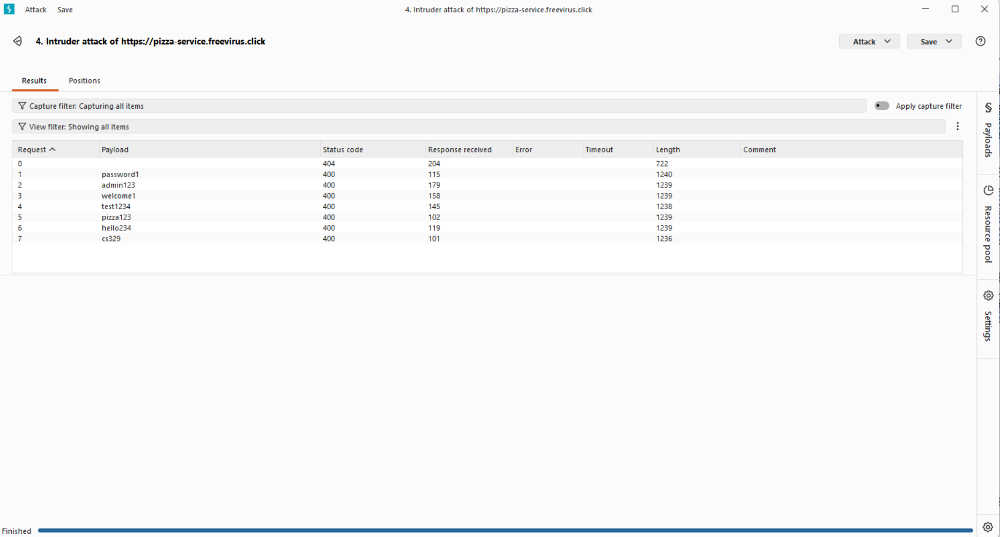   Intruder results showing different responses for each password attempt |
| Corrections    | Implement rate limiting, account lockout, and stronger password policies to prevent brute force attacks.                               |

| Item           | Result                                                                                                                                                                                             |
| -------------- | -------------------------------------------------------------------------------------------------------------------------------------------------------------------------------------------------- |
| Date           | April 13, 2026                                                                                                                                                                                     |
| Target         | https://pizza-service.freevirus.click                                                                                                                                                              |
| Classification | Mishandled Exceptions                                                                                                                                                                              |
| Severity       | 2                                                                                                                                                                                                  |
| Description    | Performed an injection-style login attempt using Burp Repeater. The server returned a detailed error message with internal file paths and function names, exposing backend implementation details. |
| Images         | 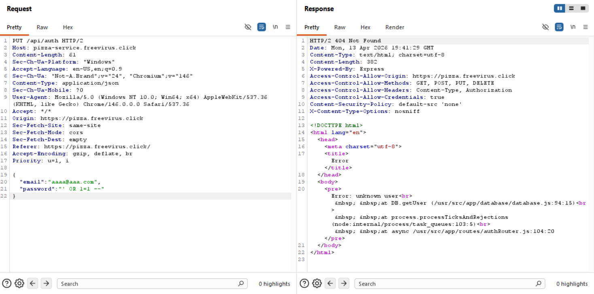   Error response showing exposed stack trace and server paths.                                                                       |
| Corrections    | Return generic error messages and hide internal details. Implement proper exception handling and secure error logging.                                                                             |

| Item           | Result                                                                                                                                                         |
| -------------- | -------------------------------------------------------------------------------------------------------------------------------------------------------------- |
| Date           | April 13, 2026                                                                                                                                                 |
| Target         | https://pizza-service.freevirus.click                                                                                                                          |
| Classification | Broken Access Control                                                                                                                                          |
| Severity       | 4                                                                                                                                                              |
| Description    | Performed a parameter tampering attack on /api/order. The server accepted a modified price of 9999, showing missing validation and potential financial impact. |
| Images         | 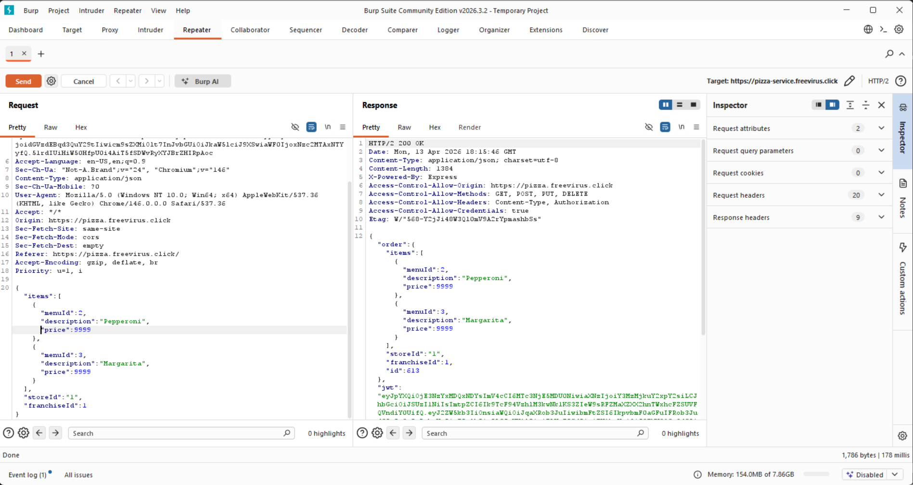   Repeater results showing modified price accepted by the server.                                |
| Corrections    | Validate all price values on the server side and ignore client-provided price data.                                                                            |

| Item           | Result                                                                                                                                                                                                                                            |
| -------------- | ------------------------------------------------------------------------------------------------------------------------------------------------------------------------------------------------------------------------------------------------- |
| Date           | April 13, 2026                                                                                                                                                                                                                                    |
| Target         | https://pizza-service.freevirus.click                                                                                                                                                                                                             |
| Classification | Insecure Design                                                                                                                                                                                                                                   |
| Severity       | 3                                                                                                                                                                                                                                                 |
| Description    | Performed a replay attack on /api/order using Burp Suite Repeater. The same request was sent multiple times, and the server created a new order each time.                                                                                        |
| Images         | 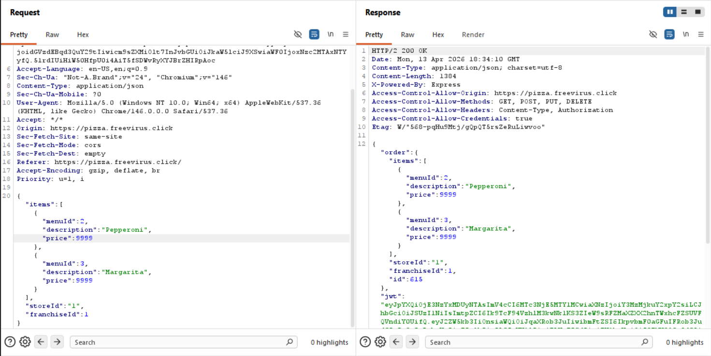   First request created order ID 615.       Second request created order ID 616 from the same request. |
| Corrections    | Prevent duplicate requests and ensure the same order is not processed multiple times.                                                                                                                                                             |

| Item           | Result                                                                                                                                                                                                                                                             |
| -------------- | ------------------------------------------------------------------------------------------------------------------------------------------------------------------------------------------------------------------------------------------------------------------ |
| Date           | April 13, 2026                                                                                                                                                                                                                                                     |
| Target         | https://pizza-service.freevirus.click                                                                                                                                                                                                                              |
| Classification | Security Misconfiguration                                                                                                                                                                                                                                          |
| Severity       | 4                                                                                                                                                                                                                                                                  |
| Description    | Performed a CORS misconfiguration test by modifying the Origin header to https://evil.com using Burp Suite Repeater. The server accepted this arbitrary origin and allowed credentials, indicating no validation of trusted domains and a potential security risk. |
| Images         | 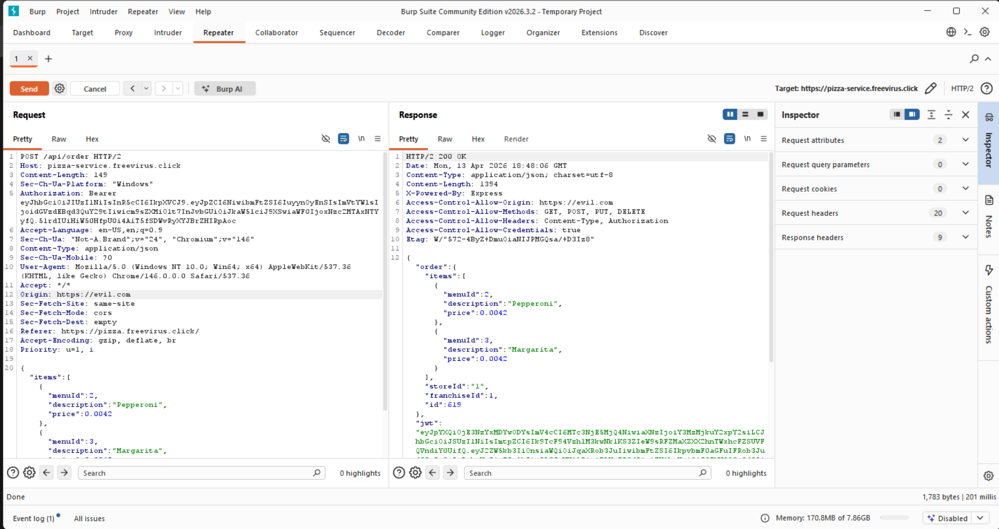   Response shows Access-Control-Allow-Origin set to https://evil.com with credentials enabled.                                                                                                       |
| Corrections    | Restrict allowed origins to trusted domains and disable credentials for untrusted origins.                                                                                                                                                                         |

### Peer 2 attack on peer 1:

| Item           | Result                                                                                              |
| -------------- | --------------------------------------------------------------------------------------------------- |
| Date           | April 9, 2025                                                                                       |
| Target         | pizza.cs329-jwt-pizza.click                                                                         |
| Classification | Security Misconfiguration                                                                           |
| Severity       | 3                                                                                                   |
| Description    | Admin credentials compromised.                                                                      |
| Images         | 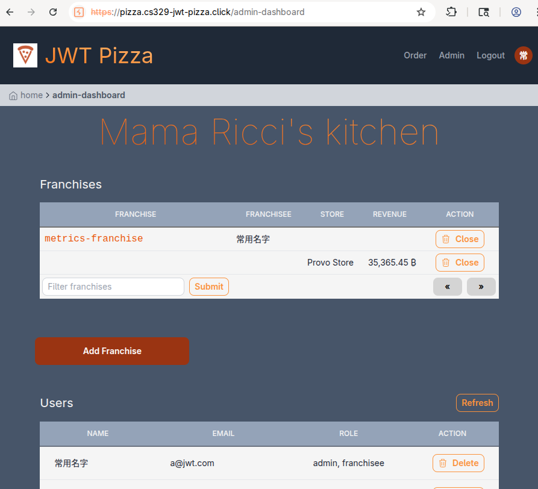   Successful admin login |
| Corrections    | Remove default admin password                                                                       |

##Combined summary of learnings
